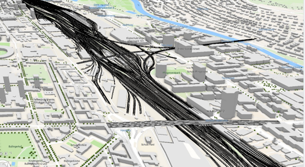

# Share and Update SLPKs from Folders

INTRO. WHAT DOES IT DOOOO?? Make sure know how different from Randy's. Using the [ArcPy script](Publish.py) in this folder, you can automate sharing 3D CAD and BIM data to ArcGIS Online.

## Use case
????

## Requirements
????
- Maybe that you need folders of the CAD and/or BIM data

## How to use the sample
Read this blog for an overview of the script: [Automate CAD and BIM publishing using scene layer packages](https://www.esri.com/arcgis-blog/products/arcgis-pro/3d-gis/automate-cad-and-bim-publishing-using-scene-layer-packages). Download the ArcPy script (path here) and adjust the code as needed. 

